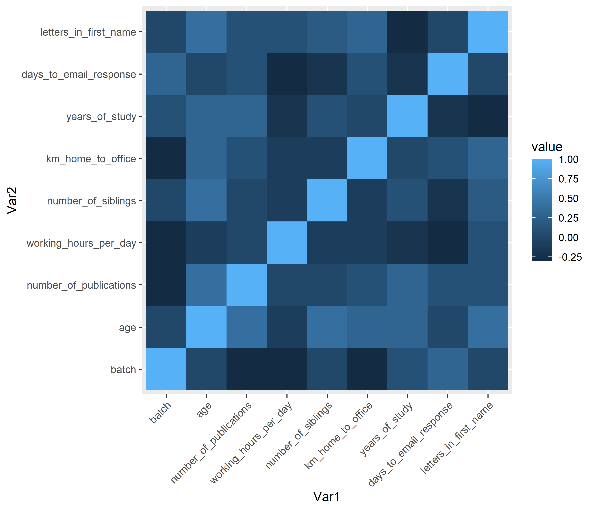

## Course Content

### Basics
In this course we are learning how to use R for making quality decision analysis and forecasts. [Cory Whitney](https://cory-whitney.com/) and [Eike Lüdeling](http://www.eikeluedeling.com/index.html) are teaching us what they learned through many years of trial and error.

The course is very interactive and focuses on the exchange between the participants, while we ourselves learn all the things we need for our group work.

All content is provided to us on an [**external website**](https://cory-whitney.shinyapps.io/Decision_Analysis_Course/), as the eCampus site is usually overloaded and very cumbersome to use.

### What we already learned
The course is split into two sections, which are a lecture on Mondays and a seminar on Wednesdays.

#### Lecture
In the lecture, we read and discuss renowned papers or books by scholars working on decision analysis. We have already worked on the following papers:

* *Douglas Hubbard - How to measure anything*
* *Ronald A. Howard - Foundations of Decision Analysis*
* *Shepard et. al. - Development goals should enable decision-making (2015)*

#### Seminar
In the seminar, we learn the basics of R and how to use them to create our own decision analysis models. We created little groups that choose a topic on which they would like to have support in decision making.

We already learned how to use basic functions to sort through data and how to create plots of the given datasets.

Here is a example from the participants_data.csv provided by Cory Whitney:

